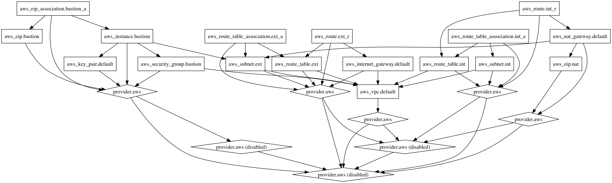

# tf\_aws\_two\_tier

a terraform module to provide a simple two-tier architecure on aws.



## Requirement

- Terraform >= 0.7.7

## Usage

```hcl
module "two_tier" {
  source = "git@github.com:accaman/tf_aws_two_tier"

  name_prefix = "env-project"
  region      = "us-west2"
  vpc         = "10.0.0.0/16"
  multi_az    = 2
  azs         = ["us-west-2a", "us-west-2b"]
  external_subnets = ["10.0.64.0/26", "10.0.64.64/26"]
  internal_subnets = ["10.0.65.0/26", "10.0.65.64/26"]

  images = {
    us-west-2        = "ami-81f62ce1"
    # ap-northeast-1 = "ami-i14r1u2i"
  }
  bastion_flavor = "t2.micro"
  ssh_whitelist  = ["203.0.113.0/24"]
  public_key = "/path/to/ec2.pub"
  key_name   = "ec2_user"
}
```

## Install

```sh
sudo sh -c "curl -sSL https://releases.hashicorp.com/terraform/0.7.7/terraform_0.7.7_darwin_amd64.zip | bsdtar -xf - -C /usr/local/bin"
sudo chmod +x /usr/local/bin/terraform
cd /path/to/repo
terraform get
```

## Contribution

1. Fork it (https://github.com/yebisu14/tf_aws_two_tier/fork)
2. Create your feature branch (git checkout -b my-new-feature)
3. Commit your changes (git commit -am 'Add some feature')
4. Push to the branch (git push origin my-new-feature)
5. Create new Pull Request

## Author

[accaman](https://github.com/accaman)
